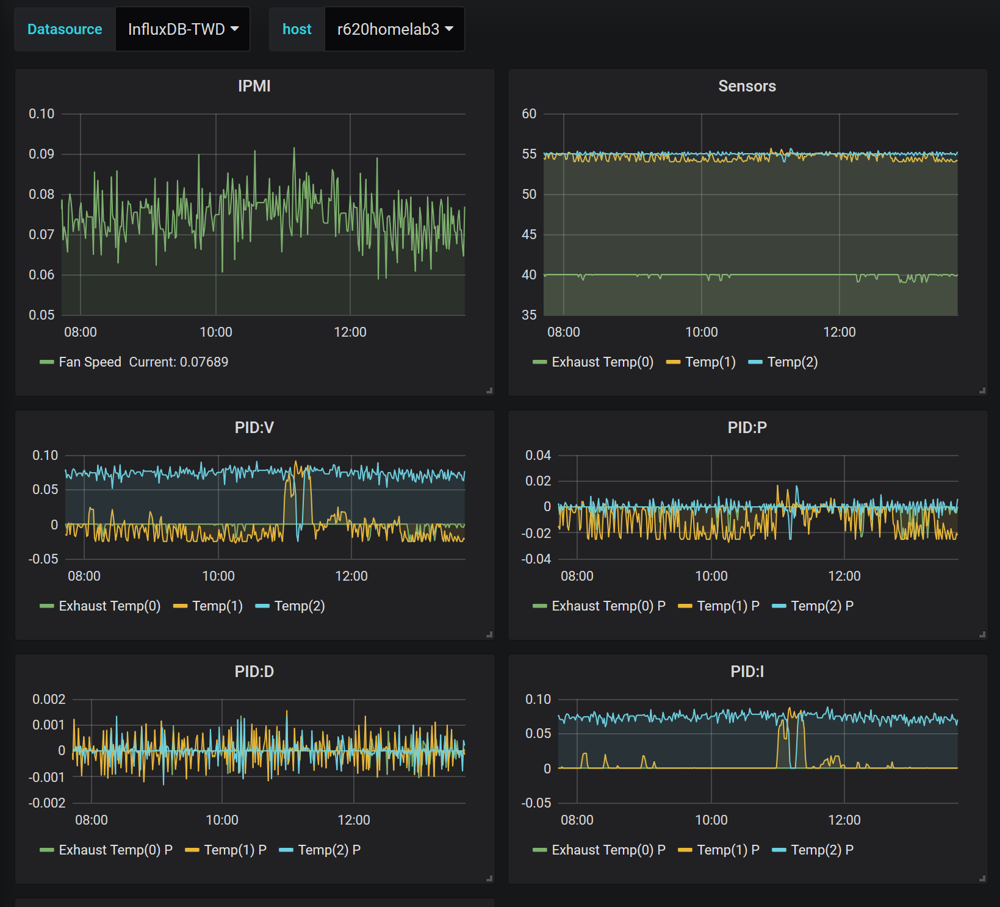

# Thermal Watchdog
This project controls the fan speed of 11th/12th gen Dell servers to keep them from sounding like a jet engine in your homelab. Using a standard PID controller via IPMI it selects an optimal fan speed for a target maximum temperature.

This was originally built to deal with the fact that unrecognized HDD/PCIe components sometimes put 11th/12th gen Dell servers into "fan overdrive" but can be used anywhere you want precise control of fan speed.

# WARNING - This project is proveded AS-IS WITH NO WARRANTY
Improperly configured this tool has the ability the **_PERMANENTLY DAMAGE_** your server! We are not responsible for any bugs, misbehavior or configurations that cause damage. It is your responsibility to propertly vet all code, understand the pid control algorithm and configuration parameters of this software.

# Installation
1. If you don't have it, install the Rust compiler: ```curl https://sh.rustup.rs -sSf | sh```
2. ```git clone https://github.com/vvanders/thermal_watchdog.git```
3. ```cd thermal_watchdog```
4. ```cargo build --release```
5. ```(sudo) apt install ipmitool```
6. ```(sudo) cargo run --release -- install```
7. ```(sudo) systemctl start thermal_watchdog```
8. ```(sudo) systemctl enable thermal_watchdog``` - If you want thermal_watchdog to start on boot.

Note that Thermal Watchdog starts in *Shadow Mode* where it will run but all IPMI commands are not actually comitted. To enable fan control read through the following configuration section.

# Configuration
After Thermal Watchdog is installed it will read from a configuration file at "/etc/thermal_watchdog.conf" that follows TOML syntax.

```
[metrics]
influx_user="admin"
influx_pw="influx"
influx_addr="http://localhost:8086"
influx_db="twd"

[pid]
k_factor = 0.025
i_factor = 0.000001
d_factor = 0
min = 5

[[controls]]
name = "Exhaust Temp"
setpoint = 40.0
failsafe = 60.0

[[controls]]
name = "Temp"
setpoint = 55.0
failsafe = 70.0

[[controls]]
name = "Temp"
setpoint = 55.0
failsafe = 70.0
```

## Pid section
The ```pid``` section controls the core PID(Proportonal, Integral, Derivative) algorithm used to keep a set of temperature sensors under a specific setpoint.

PID control works based on an ```error value``` derived from a sepcific ```setpoint```(target temperature) and ```process variable```(temperature sensor). The ```error value``` is simply ```error value = (process variable) - setpoint```. For each temperature sensor an individual PID controller is created from a set of common parameters.

* ```k_factor```: *Proportonal* based control. For each degree a specific sensor is over the ```setpoint``` this control will add ```value``` to the total fan input.
* ```i_factor```: *Integral* based control. Accumulates ```error value``` over time to find a steady-state value when temperature is constant.
* ```d_factor```: *Derivative* based control. Adds/Subtracts to the current fan control based on the rate of change in ```error value```. Helps prevent overshooting but generally can be left at 0 unless you have very spiky loads. By default tracks the difference in the last ```5``` sample points.
* ```filter_points```: Number of historical points to consider in ```d_factor```. Larger values here make ```d_factor``` smoother, lower values make ```d_factor``` respond quicker.
* ```min```: Sets a minimum fan speed(0-100) regardless of PID output.

### PID deviations from *classic* model

In order to prevent the algorithm misbehaving in destructive ways the following changes apply from a "classic" PID control:
* The accumulator for **I** Factor is clamped to ```-0.25``` to ```1.0```. This prevents a server running "under temp" to take many minutes or longer to recover once temperature exceeds setpoints.
* Final output to control is the ```max(...)``` of all current PID controllers.

## Controls section
The ```controls``` section is an array of temperature controls that are monitored and considered for fan control. Mutliple controls with the same name can be added to handle sensors that don't have a unique name.

* ```name```: Name of the sensor as listed in ```ipmitool sdr list full```.
* ```setpoint```: Target temperature for the sensor. PID controller will try to control the fans to keep the sensor below this value.
* ```failsafe```: If the sensor meets or exceeds this value **_ALL PID control will be disabled_**. It is recommended that this is set ~5 degrees below T-CASE max which you can find from a processor's relevant datasheet.

## Metrics section
This section lets you upload metrics from Thermal Watchdog to an InfuxDB server for visualization(I.E. Grafana).



* ```influx_user```: Username for InfluxDB
* ```influx_pw```: Password for InfluxDB
* ```influx_addr```: Address for InfluxDB (required)
* ```influx_db```: Database for InfluxDB (required)

All metrics include a tag with the hostname of the machine.

Thermal Watchdog publishes the following metrics:
* fan speed - Current fan output from 0.0 to 1.0.
* manual control - ```1``` If Thermal Watchdog is controlling fan output, ```0``` if it isn't(Shadow Mode).
* temp - Value for each control watch, tagged with control name.
* cpu_usage - Trending CPU usage from /prod/stats.
* p/i/d/v - Current values of PID controller(and output as ```v```) tagged with each sensor.

A pre-made Grafana Dashboard can be found [here](dashboard.json).

# Tuning controls
The defaults in ```/etc/thermal_watchdog.conf``` are meant to be a good starting point, however you will want to tune them specifically to your setup/CPU/etc.

Generally P and I terms of the PID controller are sufficent to maintain a specific setpoint. Start by adjusting I term until the temperature stays stable under idle. Once you have the server stable under idle for ~5m I've found using the ```stress -c <Total CPUs>``` gives a good idea of how the tuning behaves under sudden load.

Continue to tweak P and D terms until you have a reasonable response to IDLE -> FULL LOAD -> IDLE scenario.

# Enabling Thermal Watchdog
Once you've run Thermal Watchdog in Shadow Mode for a while you can enable fan control by editing ```/etc/systemd/system/thermal_watchdog.service```.

Replace the ExecStart line:
```
...
ExecStart=/usr/sbin/thermal_watchdog
...
```
with
```
ExecStart=/usr/sbin/thermal_watchdog -l
```

This puts Thermal Watchdog in ```live``` mode. Restart Thermal Watchdog with ```systemctl restart thermal_watchdog``` and Thermal Watchdog will now be controlling the fan output on your machine.
